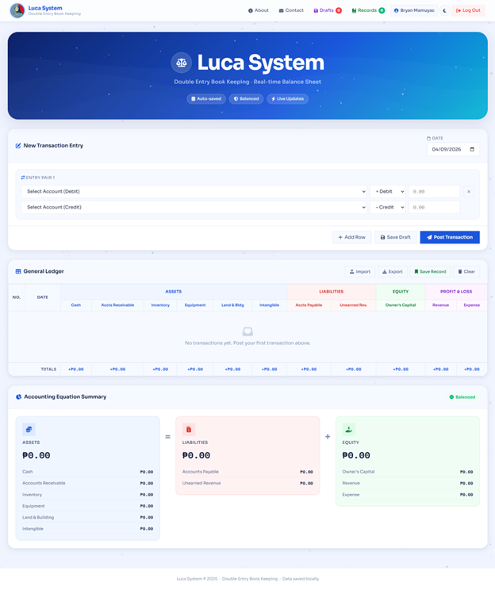
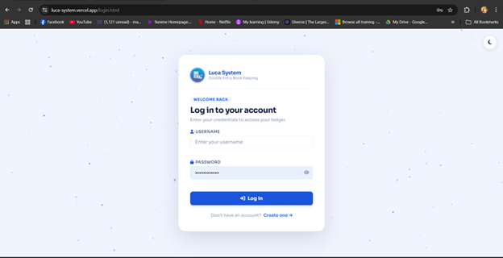
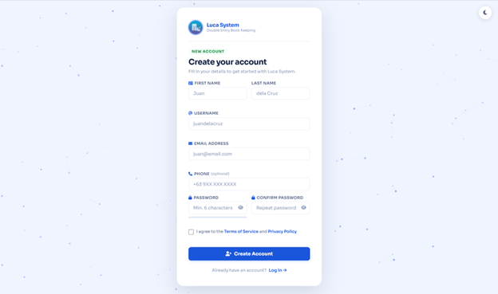
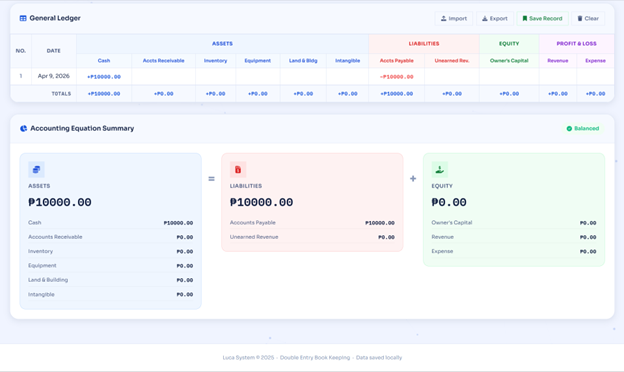
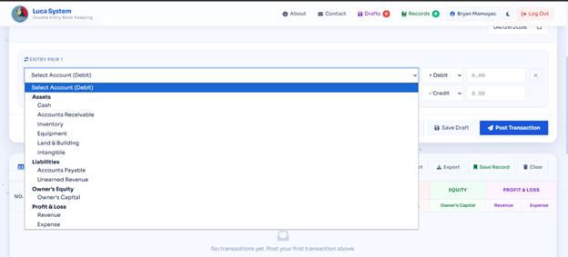
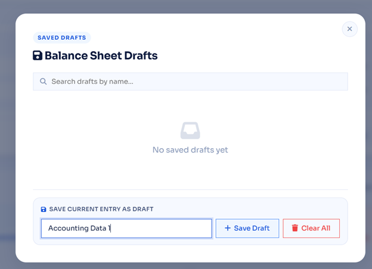
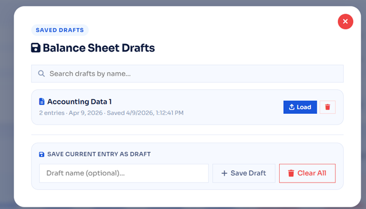
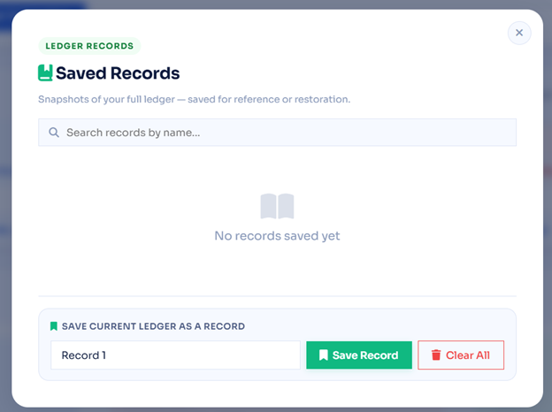
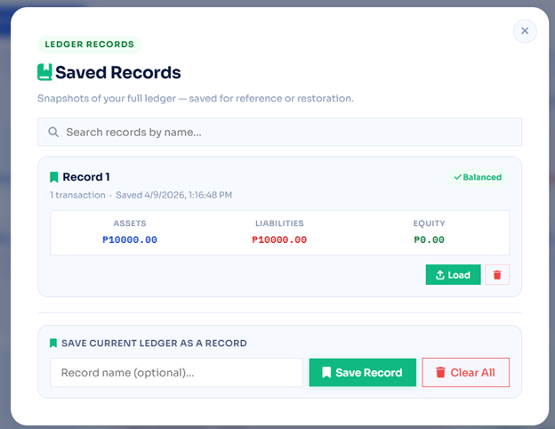

<div align="center">



<br/>
<br/>

# ⚖️ Luca System
### Double Entry Book Keeping — Real-time Balance Sheet

[](https://luca-system.vercel.app)
[](https://developer.mozilla.org/en-US/docs/Web/HTML)
[](https://developer.mozilla.org/en-US/docs/Web/CSS)
[](https://developer.mozilla.org/en-US/docs/Web/JavaScript)
[](https://vercel.com)
[](https://upstash.com)

<br/>

> Named after **Luca Pacioli** — the father of double-entry bookkeeping (1494).
> A modern web app that enforces proper accounting rules, real-time balance checking, and secure user authentication.

</div>

---

## 📋 Table of Contents

- [✨ Features](#-features)
- [📸 Screenshots](#-screenshots)
- [🛠️ Tech Stack](#️-tech-stack)
- [🧾 Accounting Logic](#-accounting-logic)
- [🚀 Getting Started](#-getting-started)
- [📁 Project Structure](#-project-structure)
- [🌐 Deployment](#-deployment)
- [👨‍💻 Author](#-author)

---

## ✨ Features

| Feature | Description |
|---|---|
| 🔐 **User Authentication** | Register & login with JWT tokens, passwords hashed with bcrypt |
| 📒 **Double-Entry Ledger** | Every transaction follows Luca Pacioli's accounting rules |
| ⚖️ **Real-time Balance Check** | Instantly shows if `Assets = Liabilities + Equity` |
| 💾 **Draft System** | Save unfinished entries as named drafts, search & load them |
| 🔖 **Records System** | Snapshot your full ledger state for reference or restoration |
| 📤 **Import / Export CSV** | Full ledger export and re-import via CSV files |
| 🌙 **Dark Mode** | Toggle between light and dark theme, preference is remembered |
| 📱 **Responsive Design** | Works on desktop, tablet, and mobile |
| ☁️ **Cloud Storage** | Accounts stored on Upstash Redis via Vercel serverless API |
| 🎨 **Animated UI** | Canvas particle background and smooth transitions |

---

## 📸 Screenshots

### 🔑 Login Page



> Secure login with username and password. Includes password visibility toggle and error feedback. Auto-redirects to the ledger if already logged in.

---

### 📝 Register Page



> Full registration form with first name, last name, username, email, phone, and password. Includes password strength meter, confirm password, and terms agreement.

---

### 🏠 Main Dashboard (Light Mode)


> The main ledger interface showing the transaction entry form, general ledger table, and accounting equation summary — all in real time.

---

### 🌙 Main Dashboard (Dark Mode)


> Full dark mode support. Toggle via the moon/sun icon in the navbar. Theme preference is saved across sessions.

---

### 📊 General Ledger & Accounting Equation Summary



> The General Ledger table categorizes each transaction across Assets, Liabilities, Equity, and Profit & Loss columns. The Accounting Equation Summary below shows live totals and balance status.

---

### 🧾 Select Account — Debit & Credit Entry



> Entry pairs enforce double-entry rules. Each pair has a Debit and Credit row. Account options are grouped by type: Assets, Liabilities, Owner's Equity, and Profit & Loss.

---

### 💾 Balance Sheet Drafts (Empty)



> The Drafts modal lets you save unfinished transaction entries by name. Includes a live search bar to filter drafts.

---

### 💾 Balance Sheet Drafts (With Data)



> Saved drafts show the entry count, date, and timestamp. Load any draft back into the form with one click, or delete it individually.

---

### 🔖 Saved Records (Empty)



> The Records modal saves a full snapshot of your posted ledger — all transactions, totals, and balance status — for future reference or restoration.

---

### 🔖 Saved Records (With Data)



> Each saved record shows a 3-column snapshot of Assets, Liabilities, and Equity, along with a Balanced/Not Balanced badge. Load the record to fully restore that ledger state.

---

## 🛠️ Tech Stack

### Frontend
| Technology | Purpose |
|---|---|
| **HTML5** | Page structure and semantics |
| **CSS3** | Custom design system with CSS variables |
| **Vanilla JavaScript** | All interactivity, accounting logic, DOM updates |
| **IBM Plex Mono** | Monospace font for financial figures |
| **Sora** | Display font for headings and UI |
| **Font Awesome 6** | Icons throughout the interface |
| **Canvas API** | Animated particle background |

### Backend & Infrastructure
| Technology | Purpose |
|---|---|
| **Vercel** | Hosting + Serverless Functions |
| **Vercel KV (Upstash Redis)** | User account storage |
| **bcryptjs** | Password hashing (12 salt rounds) |
| **jose** | JWT signing and verification |
| **Node.js** | Serverless function runtime |

---

## 🧾 Accounting Logic

Luca System follows **Luca Pacioli's double-entry bookkeeping rules (1494)**:

```
Assets = Liabilities + Equity
Equity = Owner's Capital + Revenue − Expense
```

### Normal Balance Rules

| Account Type | Normal Balance | Debit Effect | Credit Effect |
|---|---|---|---|
| **Assets** | Debit | ↑ Increase | ↓ Decrease |
| **Liabilities** | Credit | ↓ Decrease | ↑ Increase |
| **Owner's Capital** | Credit | ↓ Decrease | ↑ Increase |
| **Revenue** | Credit | ↓ Decrease | ↑ Increase |
| **Expense** | Debit | ↑ Increase | ↓ Decrease |

### Common Transaction Examples

| Transaction | Debit | Credit |
|---|---|---|
| Owner invests cash | Cash | Owner's Capital |
| Borrowed money | Cash | Accounts Payable |
| Earned revenue (cash) | Cash | Revenue |
| Paid an expense | Expense | Cash |
| Sold goods on credit | Accounts Receivable | Revenue |
| Bought inventory on credit | Inventory | Accounts Payable |

---

## 🚀 Getting Started

### Prerequisites

- [Node.js](https://nodejs.org) (LTS version)
- [Git](https://git-scm.com)
- [Vercel CLI](https://vercel.com/docs/cli) — `npm install -g vercel`
- A free [Vercel account](https://vercel.com)
- A free [Upstash account](https://upstash.com)

### Local Development

```bash
# 1. Clone the repository
git clone https://github.com/YOUR_USERNAME/luca-system.git
cd luca-system

# 2. Install dependencies
npm install

# 3. Set up environment variables
# Create a .env.local file:
KV_REST_API_URL=your_upstash_redis_url
KV_REST_API_TOKEN=your_upstash_redis_token
JWT_SECRET=your_secret_key_here

# 4. Run locally with Vercel dev server
vercel dev
```

Then open `http://localhost:3000` in your browser.

---

## 📁 Project Structure

```
luca-system/
│
├── api/                        # Vercel Serverless Functions
│   ├── register.js             # POST /api/register — create account
│   ├── login.js                # POST /api/login — authenticate user
│   └── verify.js               # GET  /api/verify — validate JWT token
│
├── docs/
│   └── screenshots/            # App screenshots for documentation
│
├── index.html                  # Main ledger dashboard (auth-gated)
├── login.html                  # Login page
├── register.html               # Registration page
│
├── styles.css                  # Main app styles + dark mode
├── auth.css                    # Login/register page styles
├── script.js                   # Ledger logic, accounting engine
├── canvas.js                   # Animated canvas backgrounds
│
├── package.json                # Node dependencies
├── vercel.json                 # Vercel routing configuration
└── README.md                   # This file
```

---

## 🌐 Deployment

This project is deployed on **Vercel** with **Upstash Redis** as the database.

### Quick Deploy Steps

1. Fork this repository
2. Import to [Vercel](https://vercel.com/new)
3. Create an **Upstash for Redis** database in Vercel Storage
4. Add environment variable: `JWT_SECRET` = any long random string
5. Redeploy — done!

> 📖 See [DEPLOY.md](DEPLOY.md) for the complete step-by-step beginner guide.

### Environment Variables

| Variable | Description |
|---|---|
| `KV_REST_API_URL` | Auto-set by Vercel when you connect Upstash |
| `KV_REST_API_TOKEN` | Auto-set by Vercel when you connect Upstash |
| `JWT_SECRET` | Your own secret string for signing tokens |

---

## 👨‍💻 Author

**Bryan Mamuyac**

[](https://github.com/bryan-mamuyac)
[](https://linkedin.com/in/bryan-mamuyac)

> BS Information Technology Graduate — DMMMSU-MLUC
> Internship: Universal Leaf Philippines, Inc. (Full-Stack Developer)

---

<div align="center">

**Luca System** © 2025 — Named after [Luca Pacioli](https://en.wikipedia.org/wiki/Luca_Pacioli), the father of double-entry bookkeeping.

*Built with vanilla HTML, CSS, and JavaScript. No frameworks. No shortcuts.*

</div>